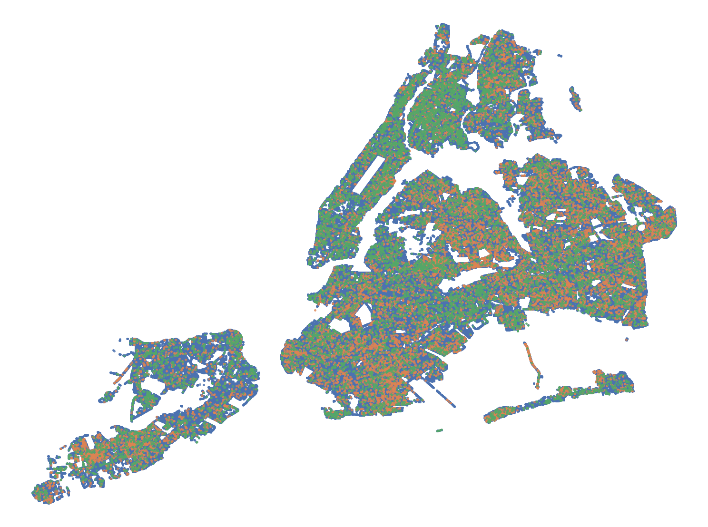

# NY 2015 Street Tree Census - Tree Health Classification

## Project Overview
A deep learning solution for classifying tree health (Good/Fair/Poor) using data from the 2015 NYC Street Tree Census. 
Built using PyTorch and served with FastAPI.



## Installation 

First, clone the repository:
```
git clone https://github.com/MikaYeghi/NYSTCTreeHealth.git
```

Then, follow the commands below to configure the Python environment to be able to run the code.

### Conda

```
conda env create -f environment.yml --name nyt
conda activate nyt
```

## Exploratory Data Analysis (EDA)

See: [EDA.ipynb](notebooks/EDA.ipynb). 

The notebook explores the dataset through various visual and statistical analyses. 
The analysis reveals a serious flaw in the dataset: the lack of local features describing the trees. This leads to conflicting records --- for example, a tree with guards and no root problems can appear both healthy and unhealthy in different instances.

## Data

Follow the steps below to configure the data properly:

1. Download the data from Kaggle: [NY 2015 Street Tree Census - Tree Data](https://www.kaggle.com/datasets/new-york-city/ny-2015-street-tree-census-tree-data/data).
2. Create a folder called `data` in the root directory of this repository:
```
mkdir data
```
3. Place the downloaded `.zip` inside the `data` folder. You should get the following directory structure:
```
data
└── 2015-street-tree-census-tree-data.csv.zip
```
4. Unzip the `.zip` file into `data/raw`:
```
cd data
unzip 2015-street-tree-census-tree-data.csv.zip -d raw/
```

You should end up with the following folder structure:
```
data
├── 2015-street-tree-census-tree-data.csv.zip
└── raw
    └── 2015-street-tree-census-tree-data.csv
```

## Data Preprocessing

Based on the observations in EDA, a set of preprocessing steps have been composed and implemented in [preprocess.py](preprocess.py). To preprocess the raw data, run:

```
python preprocess.py
```

## Model

### Selection

Here, we use a very simple hand-crafted shallow multi-layer perceptron to be able to handle the non-linearities in the underlying distributions, while acknowledging the absence of need in a very sophisticated model, because the dataset is small and the number of underlying variables is not too big.

A more thorough approach would be to identify a set of models (e.g. include trees, transformer-based models, etc.) and rigorously assess the trade-offs between them by evaluating on the validation data.

### Training

The following command will train a shallow feed-forward multi-layer perceptron (MLP).

```
python train.py
```

Model checkpoints are saved under `saved_models/`. 

During training, evaluation results on the validation data are also printed. 
The model was evaluated using macro-averaged F1 score to account for class imbalance across the "Good", "Fair", and "Poor" labels. On the validation set, the model achieved:
- Macro F1 Score: 57%

Note: the macro-averaged F1 score is the average of F1 scores for each class.

### Inference

The following command will run inference using the last best checkpoint.
```
python inference.py
```
Running the script above will also print key metrics associated with evaluation on the test dataset. You should expect F1 score of around 40% (not great!).
```
              precision    recall  f1-score   support

           0       0.28      0.42      0.33        60
           1       0.88      0.65      0.75       260
           2       0.11      0.33      0.16        18

   micro avg       0.59      0.59      0.59       338
   macro avg       0.42      0.47    **0.41**     338
weighted avg       0.73      0.59      0.64       338
 samples avg       0.59      0.59      0.59       338

Macro-averaged F1 score: 41.44%.
```

## FastAPI Endpoint

Launch the application with the following command:
```
uvicorn main:app --reload
```

In another terminal, either use the [client.py](client.py) script to automatically send 5 POST requests to the application using the testing data or send a POST request manually:
```
# Option 1: Using client.py
python client.py

# Option 2: Manually (from terminal)
curl -X POST http://127.0.0.1:8000/predict \
-H "Content-Type: application/json" \
-d '{
  "tree_dbh": 4.0,
  "curb_loc": 0.0,
  "sidewalk": 0.0,
  "root_stone": 0.0,
  "root_grate": 0.0,
  "root_other": 0.0,
  "trunk_wire": 1.0,
  "trnk_light": 0.0,
  "trnk_other": 0.0,
  "brch_light": 1.0,
  "brch_shoe": 0.0,
  "brch_other": 0.0,
  "x_sp": 985070.8067,
  "y_sp": 202593.6428,
  "steward_1or2": 0.0,
  "steward_3or4": 1.0,
  "steward_4orMore": 0.0,
  "steward_None": 0.0,
  "guards_Harmful": 1.0,
  "guards_Helpful": 0.0,
  "guards_None": 0.0,
  "guards_Unsure": 0.0,
  "user_type_NYC_Parks_Staff": 1.0,
  "user_type_TreesCount_Staff": 0.0,
  "user_type_Volunteer": 0.0
}'
```